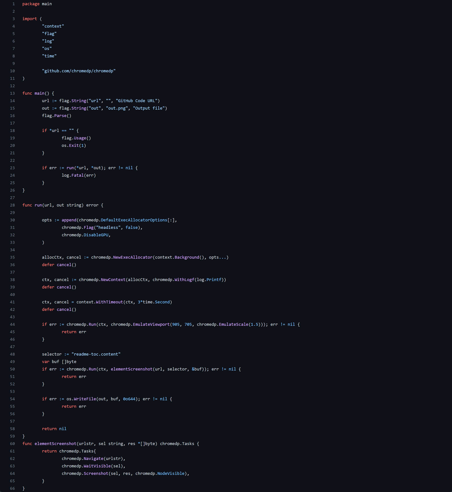

<samp>

github_screenshot
===

This is a simple script to take a screenshot of a github repository and save it as a png file.

Usage
---

    $ go run main.go -url https://github.com/Sigumaa/github_screenshot -output github_screenshot.png

Example Image
---

</samp>
